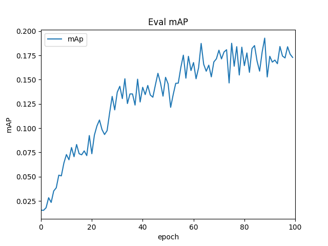
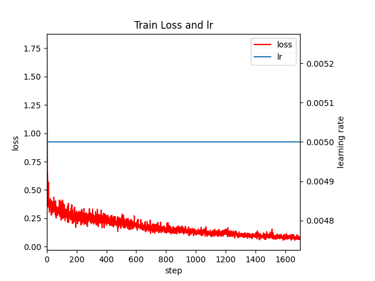

# MSDS20018_Project_DLSpring2021

# Dataset Link

[Dataset here](https://drive.google.com/drive/u/0/folders/1yTuWZM-5HQYiTXteFZUJgpEdyI2gYu7F)

# Dependencies
- numpy
- torch
- torchvision
- Pillow
- pycocotools
- matplotlib
- tensorboardX

# Model Training

!python train.py --model_save_dir /mydrive/FasterRCNN/checkpoints

# Evaluation Results

Training mAp  | 0.98
------------- | -------------
Validation mAP | 0.17
Best mAp  | 0.19

## mAp vs epochs

## Training Loss and Learning Rate

# Model Testing

!python test.py

# Detection Results

